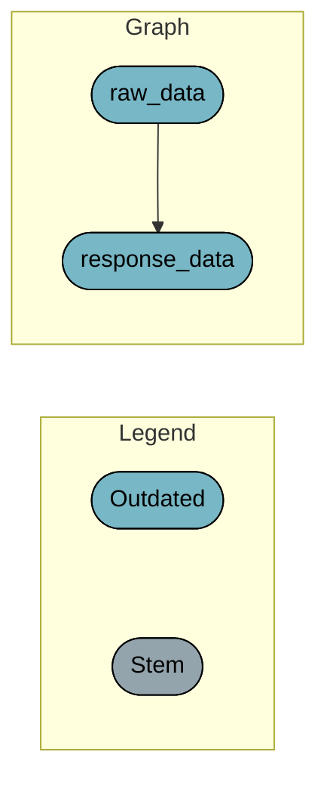

<!-- README.md is generated from README.Rmd. Please edit that file -->

# modds

<!-- badges: start -->
<!-- badges: end -->

An example showcasing modern data science tools in R.

## Pipeline

``` r
tar_target(raw_data, airquality)
#> Establish _targets.R and _targets_r/targets/raw-data.R.
```

``` r
tar_target(response_data, clean_raw_data(raw_data))
#> Establish _targets.R and _targets_r/targets/response-data.R.
```

``` r
cat(c("```mermaid", tar_mermaid(), "```"), sep = "\n")
```


